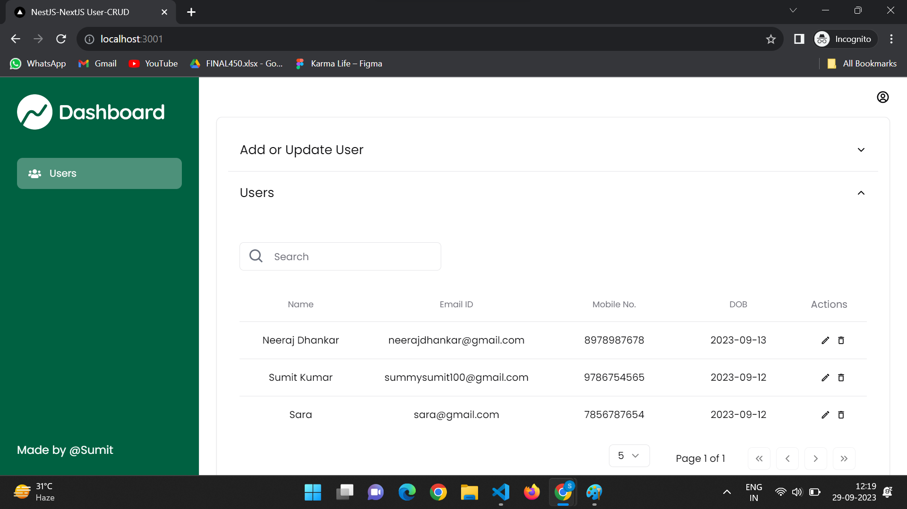
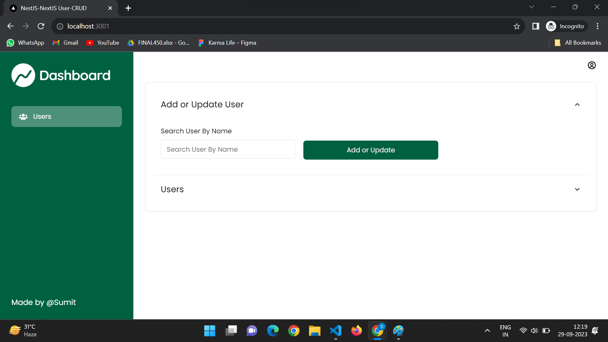
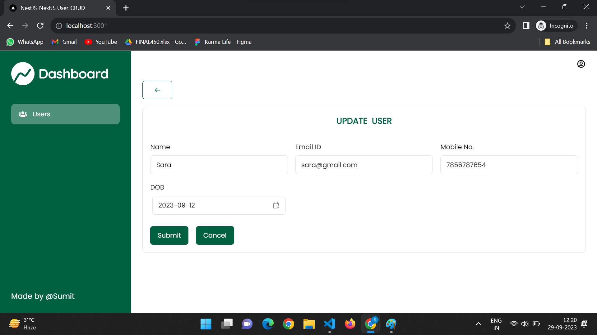
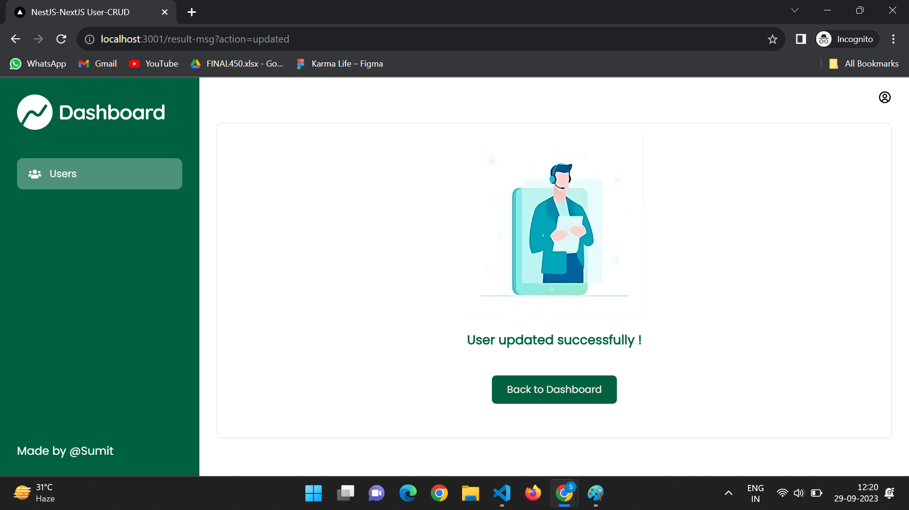

# NestJS-NextJS App

Welcome to the User CRUD App repository! This app allows you to perform CRUD (Create, Read, Update, Delete) operations on user data. The backend is built using NestJS, while the frontend is developed using React/Next.js. This guide will help you set up and use the app.

## Features

- Create, read, update, and delete user records
- Search user recoders
- Pagination & filters
- Swagger documentation available at http://localhost:3000/api-docs/

## Technologies Used

- Backend:
  - NestJS
  - PostgreSQL (make sure you have it installed)

- Frontend:
  - React/Next.js

## Setup

- Make sure you have Node.js and PostgreSQL installed on your system.
- Clone this repository.
   ```bash
   git clone https://github.com/sumit-singh1196/nest.js-next.js-app.git

### Backend Setup Without Docker

The server will run on port 3000, and you can access the Swagger documentation at http://localhost:3000/api-docs/

1. Change to the backend directory.
   ```bash
   cd nest-backend
2. Install the required Node.js packages.
   ```bash
   npm install
3. Create a fresh database for the app. You can update the database configuration in the `.env` file with your PostgreSQL password and database name.
4. Start the server.
   ```bash
   npm run start:dev

### Backend Setup With Docker

If you prefer using Docker, you can use the following steps to set up the backend in a Docker container:

1. Make sure you have Docker installed on your system.
3. Run the following Docker Compose command to create a container and start the server:
   ```bash
   docker-compose up

## Frontend Setup

The frontend will be accessible at http://localhost:3001.

1. Change to the frontend directory.
   ```bash
   cd next-frontend
2. Install the required Node.js packages.
   ```bash
   yarn install
   # OR
   npm install
3. Start the server.
   ```bash
   yarn preview
   # OR
   npm preview

## Preview Images






## Usage
You can now use the User CRUD App to manage user records, perform CRUD operations, and utilize server-side pagination and filtering. Feel free to explore the Swagger documentation for available endpoints and try them out.

## Contributing
If you'd like to contribute to this project, please follow these steps:

1. Fork the repository.
2. Create a new branch for your feature or bug fix.
3. Make your changes and commit them.
4. Push your changes to your forked repository.
5. Create a pull request to merge your changes into the main repository.

##License
This project is licensed under the [user-crud-app-license] License - see the LICENSE.md file for details.

Thank you for using the NestJS-NextJS User CRUD App!
